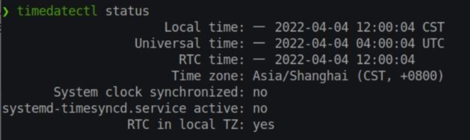

# 1. 安装linux

| 官方                                                         | 下载镜像                                                     |
| ------------------------------------------------------------ | ------------------------------------------------------------ |
| [Ubuntu](https://ubuntu.com/)                                | [Ubuntu26.04.1 清华镜像](https://mirrors.tuna.tsinghua.edu.cn/ubuntu-releases/26.04.1/) |
| [CachyOS](https://cachyos.org/)                              | [CachyOS 中科大镜像](https://mirrors.ustc.edu.cn/cachyos/ISO/desktop/) |
| [Pop!_OS](https://system76.com/pop?srsltid=AfmBOoqMsCCYIzJL8FfY70wd0kZ_DHG4ZPSdiDAGLBqqDT2URv7NTz3b) | [Pop!_OS 官方](https://system76.com/download-pop/)           |

[校园网联合镜像站](https://mirrors.cernet.edu.cn/)

# 2. 修改源

## 2.1. Ubuntu 26.04 LTS

```bash
sudo nano /etc/apt/sources.list.d/ubuntu.sources
```

复制替换

```
Types: deb
URIs: https://mirrors.tuna.tsinghua.edu.cn/ubuntu
Suites: resolute resolute-updates resolute-backports
Components: main restricted universe multiverse
Signed-By: /usr/share/keyrings/ubuntu-archive-keyring.gpg

# 默认注释了源码镜像以提高 apt update 速度，如有需要可自行取消注释
# Types: deb-src
# URIs: https://mirrors.tuna.tsinghua.edu.cn/ubuntu
# Suites: resolute resolute-updates resolute-backports
# Components: main restricted universe multiverse
# Signed-By: /usr/share/keyrings/ubuntu-archive-keyring.gpg

# 以下安全更新软件源为官方源配置
Types: deb
URIs: http://security.ubuntu.com/ubuntu/
Suites: resolute-security
Components: main restricted universe multiverse
Signed-By: /usr/share/keyrings/ubuntu-archive-keyring.gpg

# Types: deb-src
# URIs: http://security.ubuntu.com/ubuntu/
# Suites: resolute-security
# Components: main restricted universe multiverse
# Signed-By: /usr/share/keyrings/ubuntu-archive-keyring.gpg

# 预发布软件源，不建议启用

# Types: deb
# URIs: https://mirrors.tuna.tsinghua.edu.cn/ubuntu
# Suites: resolute-proposed
# Components: main restricted universe multiverse
# Signed-By: /usr/share/keyrings/ubuntu-archive-keyring.gpg

# # Types: deb-src
# # URIs: https://mirrors.tuna.tsinghua.edu.cn/ubuntu
# # Suites: resolute-proposed
# # Components: main restricted universe multiverse
# # Signed-By: /usr/share/keyrings/ubuntu-archive-keyring.gpg
```

## 2.2. CachyOS

安装时指定

```bash
# 切换到 root 用户
sudo su -

# 进入 pacman 配置目录
cd /etc/pacman.d/

# 配置 CachyOS 国内镜像（以中科大为例）
echo "Server = https://mirrors.ustc.edu.cn/cachyos/repo/\$arch/\$repo" > cachyos-mirrorlist
echo "Server = https://mirrors.ustc.edu.cn/cachyos/repo/\$arch_v3/\$repo" > cachyos-v3-mirrorlist
echo "Server = https://mirrors.ustc.edu.cn/cachyos/repo/\$arch_v4/\$repo" > cachyos-v4-mirrorlist

# 同时配置 Arch Linux 国内镜像
echo "Server = https://mirrors.ustc.edu.cn/archlinux/\$repo/os/\$arch" > mirrorlist
```

## 2.3. Pop!_OS

```bash
sed -i 's@http://apt.pop-os.org/@https://mirror.sjtu.edu.cn/pop-os/@g' /etc/apt/sources.list.d/pop-os-apps.sources
sed -i 's@http://apt.pop-os.org/@https://mirror.sjtu.edu.cn/pop-os/@g' /etc/apt/sources.list.d/pop-os-release.sources
sed -i 's@http://apt.pop-os.org/@https://mirror.sjtu.edu.cn/@g' /etc/apt/sources.list.d/system.sources
```

# 3. 与Windows双系统时间不一致

Windows认为BIOS是当地时间，linux认为BIOS是UTC时间

解决方法

```bash
timedatectl set-local-rtc 1
```

验证

```bash
timedatectl status
```

